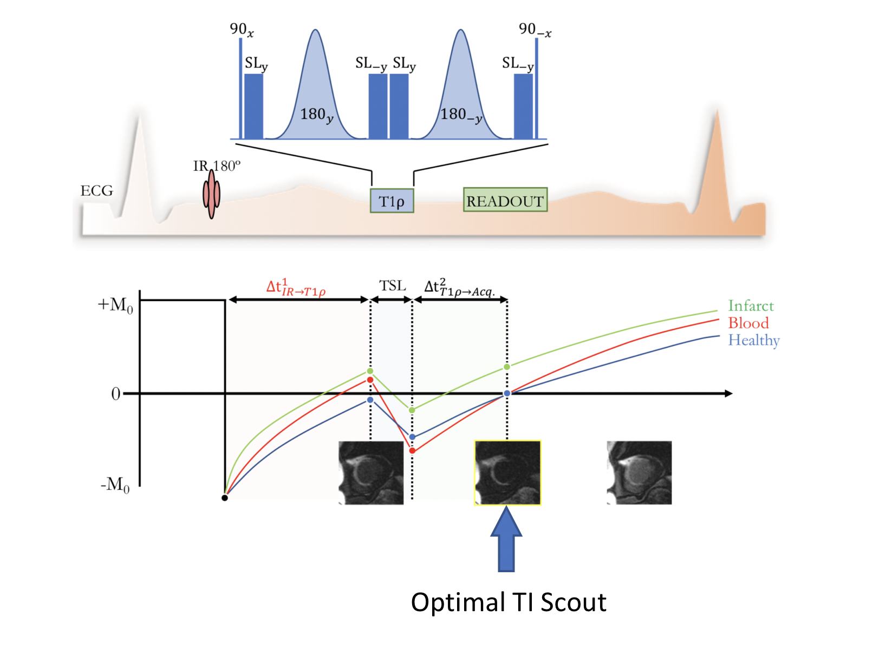

# Optimal Inversion Time Extractor on Cardiac MRIs
________

## Project Context

MRIs images are largely used for the evaluation of myocardial scar and other cardiac anomalies' diagnosis.
Bordeaux's Institute of Cardiology (IHU-Liryc) recently developed a technique based on black-blood capable of 
augmenting the contrast between blood signals and muscular tissues on MRIs. They inject a contrast agent called 
Gadolinium to get this better visualization
The black Blood MRI images they generate contain a sequence of MRI generated at different
instants. Image contrast vary with time as it impregnates gradually the muscle tissues.

'

The contrast is the best on MRIs images when blood signal is null.
However, the selection of the optimal inversion time TI (instant 
for which MRI has the best rendering) is quite challenging. The chosen image must be always exploitable 
in order to favor cardiac diagnosis. Otherwise, we could miss important pathologies.

This project is aimed to propose an algorithm based on CNN to extract automatically the image corresponding
to the optimal TI. It would enable the radiologist to gain much time in their work, by studying directly on treated images.

## Project Set Up (MUST BE DONE AT FIRST)
___
### 1) Packages and directories
Please, if you just cloned the git, you first must run the line:

``` python3 requirements.py ```

This line will install all the needed packages for the project, as well as data directory.

A second step is to adapt the project constants depending on your computer. Go to the file 
``` project_config.py```. This file contains the paths to the project.
1. Fill **PATH_TO_THE_PROJECT** with the corresponding path.

### 2) Data Folder
I adopted this structure regarding Aurelien Bustin's data.
The data folder will have the following shape:
```
Optimal-TI-Extractor
|--data
|  |--TIScoutBlackBlood
|  |  |--1
|  |  |  |--data.mat
|  |  |--2
|  |  |  |--data.mat
|  |  |--3
|  |  |  |--data.mat
|  |  |--4
|  |  |  |--data.mat
|  |  |-- ...
```
Where the files annotated by a number correspond to an MRI Sequence of a single patient.
```data.mat``` contains the MRI sequence and the corresponding headers.

## How to use the Optimal TI Scout labelling APP
___
Then to launch the app, you just need to launch the script in the terminal:
```
cd lib/labelling/core_functions
python3 optimal_ti_labelling.py
```
**Please read carefully the remarks made before the labelling to understand how to proceed.**

### Bonus: Several remarks
1. Ground Truth annotations done by several people, to have a consensus on best image renderings
   (generate an app capable to automatize this annotation)
